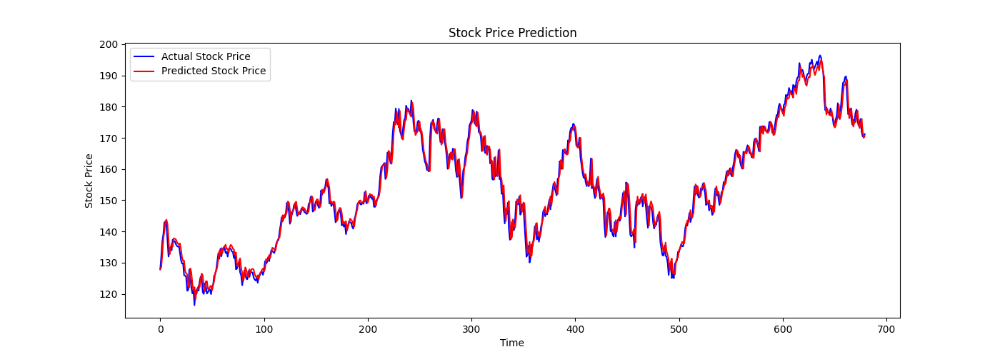

# Financial Time Series Analysis and Forecasting

## Project Overview

This project aims to analyze and forecast stock prices using deep learning techniques, including Long Short-Term Memory (LSTM) networks, Bidirectional LSTMs, and Attention Mechanisms. The model is designed to predict future stock prices based on historical data, 
offering insights that can help with investment decisions. The project also includes hyperparameter tuning for optimal performance.

## Project Structure

Financial_Time_Series_Analysis/ ├── data/ ├── models/ ├── scripts/ ├── outputs/ ├── README.md └── LICENSE


- **data/**: Contains the raw and preprocessed stock market data.
- **models/**: Stores trained model checkpoints and the scaler.
- **scripts/**: Python scripts for data collection, preprocessing, model building, and evaluation.
- **outputs/**: Contains the results of the model evaluation, including charts and metrics.

## Setup Instructions

### 1. Clone the Repository

```bash
git clone https://github.com/yourusername/Financial_Time_Series_Analysis.git
cd Financial_Time_Series_Analysis

2. Create Virtual Environment
bash
Copy code
python3 -m venv venv
source venv/bin/activate
3. Install Dependencies
bash
Copy code
pip install numpy pandas matplotlib scikit-learn tensorflow keras yfinance
4. Run the Scripts in Order
Data Collection

Download the historical stock data (e.g., Apple Inc. stock from 2010 to 2023):

bash
Copy code
python scripts/data_collection.py
Data Preprocessing

Prepare the data for model training by normalizing and generating sequences:

bash
Copy code
python scripts/data_preprocessing.py
Model Training

Train the model using Bidirectional LSTMs:

bash
Copy code
python scripts/model_training.py
Model Evaluation

Evaluate the model and visualize the predictions against actual stock prices:

bash
Copy code
python scripts/model_evaluation.py
Advanced Model Training (Optional)

Train the enhanced model with Attention Mechanism:

bash
Copy code
python scripts/advanced_model.py
Usage

The project consists of the following key functionalities:

Data Collection: Downloads historical stock data from Yahoo Finance.
Data Preprocessing: Prepares the data by creating sequences, normalizing, and splitting it into training and testing sets.
Model Training: Builds and trains an LSTM model for time series forecasting.
Model Evaluation: Evaluates the model performance and visualizes predictions vs. actual stock prices.
Enhancements: Improves the model using an advanced architecture with Bidirectional LSTMs and Attention Mechanism.

Results

The LSTM-based model was able to capture the overall trend of Apple Inc. stock prices. Below is an example of the model’s predictions compared to the actual stock prices:



### Model Performance

- **Training Loss**: The model achieved a mean squared error (MSE) of `2.5556e-05` on the training set.
- **Validation Loss**: On the validation set, the model achieved an MSE of `2.2135e-04`, indicating that it was able to generalize well to unseen data.

The model demonstrates strong predictive capabilities, capturing the overall trend of stock prices, making it useful for identifying market trends and future price movements.

License

This project is licensed under the MIT License - see the LICENSE file for details.

Acknowledgments

Yahoo Finance for providing the stock market data.
TensorFlow and Keras communities for resources on deep learning and time series analysis.


